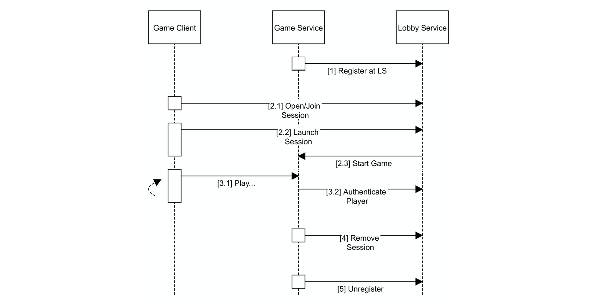

# Game Dev Essentials

LS essentials, compiled for game-developers.

## About

Goal of the LS is to provide generic board game functionality, that is to say functionality that is required for any board game implementation. To ensure platform and programming language independence, the LS exposes all functionality through a REST API. This means, the LS can be accessed from any language that supports HTTP.

This remainder of this page deals with the following: Paradigms of the LS that every Game-Developer must know about. A use-case scenario of the typical communication between a game-implementation and the LS. Minimal functional requirements, that any game-implementation must fulfil.

 * [Key concepts](#key-concepts) - Paradigms of the LS that every Game-Developer must know about.
   * [Authentication](#authentication)
   * [User management](#user-management)
   * [Game-services](#game-services)
   * [Session management](#session-management)
   * [Savegames](#savegames)
 * [Communication](#communication)
 * [Main workflow](#main-workflow) - A use-case scenario that illustrates communication between a game and the LSs API.
 * [Callbacks](#callbacks) - Minimal interfaces, that any LS compatible game-service must implement.

## Key Concepts

This section explains LS key concepts and their interplay.

### Authentication

Authentication is the process of verifying the identity of a communication partner. The main purpose of authentication is to authorize requests that are restricted to specific users or require specific priviledges.  
The LS implements the [OAuth2](https://oauth.net/2/) token-based authorization standard.  

 * Users use their credentials [to create and retrieve a temporary token pair](api.md#user-content-authentication). The pair consists of:
    * A sign-in token, which can be added as request or header parameter, to access protected API methods. This token expires after 30 minutes.
    * A refresh-token, which can be used to renew the sign-in token, after expiry. This token expires after 4 hours.  
    Using these tokens allows for a client to remain logged in, without storing unprotected user credentials.
 * Tokens can be [actively revoked](api.md#user-content-authentication), e.g. on an intentional sign-out.
 * Tokens can be [resolved to their owner-name and owner-provileges](api.md#user-content-authentication).
 * Tokens can be passed to third party services, notably game-services. These services can in their turn invoke the LS API to authenticate users why access protected game-service functionality.

  > *Example: If in a running game a user makes a turn, this action should be restricted this specific user. The user can add a session-token to her request, when contacting the game-service. The game-service can in its own turn authenticate the user by internally calling the LS's authentication mechanism.* [[3.1/3.2]](#main-workflow)

### User Management

The LS comes with a build-in DB-persisted user management. The LS identifies users by their unique name (primary key). Users fall into two categories:
 * **Administrators**, who are allowed to [create, modify and delete other users](api.md#user-content-users).  
 The [registration / removal of game-servers](api.md#user-content-game-services) also requires administrator-privileges.
 * **Players**, who are allowed to [create and participate in sessions](api.md#user-content-sessions) that ultimately generate game-launch parameters for game-servers.  
 Players can also [modify their own profile data](api.md#user-content-users).

The LS comes with 5 built-in users:
 * A default administrator, which can be used create new custom users / administrators:
   * Identifier: ```admin```
   * Password ```admin```
 * The 5 built-in users should not be altered on dev systems, because they are needed for unit-testing.
 
  > *Note: User deletion can have side effects, such as the implicit removal of games / sessions where a player participated, as well as the removal of game-services registered by a deleted administrator.* 

### Game-services

The LS has no built-in games. Game-implementations must therefore notify the LS about their existence and location of their server-side component (game-service). This happens at the [game-service registration](api.md#user-content-game-services). [[1]](#main-workflow)
 * Once registered, the LS automatically allows [creation of corresponding sessions](api.md#user-content-sessions) by users.
 * On every session launch (ready-to-play notification), the corresponding game-service is [called at a subresource of the provided location](#callbacks).
 * The LS does not persist game-service registrations. On every LS restart, game-services should therefore renew their registration.  
 * Game-services should [notify the LS when they become unavailable](api.md#user-content-game-services), so the corresponding game is no longer offered to the users. [[5]](#main-workflow)

### Session Management

A session is a concept that gathers users for the purpose of playing a specific game. The lifecycle of a session is as follows:

 1. A player selects a game from the [list of registered game-services](api.md#user-content-game-services) and [creates a corresponding session](api.md#user-content-sessions). The LS creates a random unique id for the newly created session and marks the player as the responsible *creator*. [[2.1]](#main-workflow)
 2. Other players [discover the newly available session](api.md#user-content-sessions) and [issue a join request](api.md#user-content-game-services) using the specific session-id. [[2.1]](#main-workflow)  
 As long as the session is not yet launched, players can also [retreat from the session](api.md#user-content-sessions) again. (Retreat of the *creator* implicitly dissolves the session.)
 3. Once enough players have joined, [the *creator* launches](api.md#user-content-sessions) the session. [[2.2]](#main-workflow)
 4. The LS [notifies the corresponding game-service to create a game-instance](#callbacks), using the provided session-id. [[2.3]](#main-workflow)
 
### Savegames

Savegames allow the continuation of a game at particular predefined state.

 * Game-services can [notify the LS about the availability of savegames](api.md#user-content-savegames). The LS then indexes a provided unique savegame identifier, which is from there on [discoverable by players](api.md#user-content-savegames).  
Note that the LS only stores savegame-identifiers, while actual associated game-data remains at the corresponding game-service.
 * Savegames are not launched directly. Instead, players [fork as session from an indexed savegame](api.md#user-content-sessions).
 * Sessions forked from savegames can only be launched if the amount of participants matches the savegame.  
 Players can however be different to the original participants. In the latter case the game-service should map the players in order of appearance.
 * Savegames can also be [unregistered by the associated game-service](api.md#user-content-savegames).

## Communication

The following sections cover the intended messages and communication between LS and game-specific components.

### Main workflow

This section illustrates the principal communication between the LS, a registered Game-server and a corresponding Game-client.



1. Game-service registers at the LS.
2. User creates a session, other users join in.
3. User play the game. Players repeat this step until the game has ended or was actively stalled by the LS.
   1. Player makes her move by accessing a *protected* game service resource. That is to say, the player either requests private information or modifies the game state in a way that is restricted to her.
   2. The  game service authenticates the user, by resolving an included session-token to a username.
4. Game-service notifies LS that the game instance has ended.
5. Prior to shut down, game-service unregisteres at LS. 

### Callbacks

As described above, the LS stipulates any registered game-service to implement the following REST interface specifications.


 > Note: ```...baseurl``` stands for the URL provided to the LS at game-service registration.

The LS will invoke the above REST endpoints as follows:

 * /...baseurl/api/games/{gameid}
   * ```PUT```: Request to create new game instance at the registered game-service, using the provided gameid. Session information is passes as body payload. If a savegame-id is contained this means that the game picks up from the corresponding gamestate. In the latter case, the json provided users are mapped on the users of the savegame in order of appearance.
     * Header-Parameters: ```Content-Type: application/json```
     * Request-Body:  
        ```json
        {
            "creator": "maex",
            "gameServer": "Colt Express",
            "players": [
                {
                    "name": "maex",
                    "preferredColour": "CAFFEE"
                },
                {
                    "name": "joerg",
                    "preferredColour": "1CE7EA"
                }
            ],
            "savegame": ""
        }
        ```
   * ```DELETE```: Advises a registered game-server to immediately stop a running game. This enpoint is called if a game precondition is suddenly removed, e.g. one of the participant accounts was deleted.
 * /...baseurl/webui/games/{gameid}
   * ```GET```: Optional end-point that is only required if the game supports web-based direct-access from a generic external web-lobby. Game-services indicate at the moment of registration, whether this endpoint is supported. The endpoint should return the HTML/Javascript landing page for a game of the corresponding gameid.
